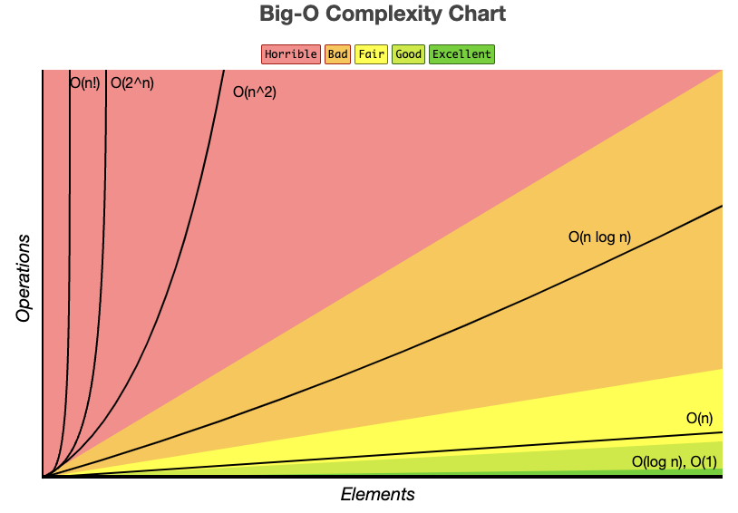

### 1. 시작

**알고리즘의 성능을 분석 하기 위해서는** 빅오 표기법을 사용한다. 데이터 개수(n)가 주어졌을 때 덧셈, 뺄셈, 곱셈 같은 기본 연산의 횟수를 의미한다.  
빅오 표기법은 보통 알고리즘의 <u>시간 복잡도와 공간 복잡도</u>를 나타내는데 주로 사용 된다.  
얼마나 빠르게 실행하는가? 시간복잡도 
얼마나 많은 공간을 차지하는가? 공간복잡도 (이때, 공간은 메모리를 의미)

### 2. 점근 표기법

점근 표기법이란, 어떤 함수의 증가 양상을 다른 함수와 비교하기 위해 사용되는 표기법으로, 점근 표기법에는 대표적으로 아래와 같은 3가지가 있다.
 

- **Big-O(빅오) 표기법**
  - 알고리즘 <u>최악</u>의 실행 시간을 표기한다.
  - 가장 많이 사용하는 표기법이다.
  - 최소한 보장되는 성능을 표기하기 때문에 가장 일반적으로 사용한다.
- **Big-Ω(빅오메가) 표기법**
  - 알고리즘 <u>최상</u>의 실행 시간을 표기한다.
- **Big-θ(빅세타)**
  - 표기법 알고리즘 <u>평균</u> 실행 시간을 표기한다.

### 3. 빅오표기법 특징

- 상수, 계수는 무시한다.
  시간복잡도에 미미한 영향을 주는 것들은 배제하고 표기한다.  
  ex) O(n+3)은 O(n) / O(500n)은 O(n)
- 최고차항만 표기한다.  
  어떤 알고리즘이 O(3n3+2n2+n+5)의 복잡도를 가졌으면 O(n3)으로 표기한다.

### 4. 빅오표기법 표기

실행속도 O(1) < O(logn) < O(n) < O(nlogn) < O(n2) < O(n3) < O(2n) < O(n!)

 

- **O(1) - Constant Time**  
  입력의 크기와 상관 없이 항상 같은 시간이 걸리는 알고리즘이다.
  &rarr; 배열, 해시테이블의 요소의 접근할 때 
- **O(logn) - Log Time** 
  연산이 한 번 실행될 때 마다 데이터의 크기가 절반 감소하는 알고리즘 (log의 지수는 항상 2)
  &rarr; 이진탐색, 힙 삽입/삭제 등
- **O(n) - Linear Time**  
  입력값(N)이 증가함에 따라 실행시간도 선형적으로 증가하는 알고리즘
  &rarr; 1중 for문
- **O(nlogn) - Log linear Time** 
  O(n)의 알고리즘과 O(logn)의 알고리즘이 중첩된 형태
  &rarr; 퀵 / 병합 / 힙 정렬
- **O(n2) - Quadratic Time**  
  &rarr; 2중 for문, 삽입/버블/선택 정렬
- **O(n3) - Cubic Time**  
  3중 반복을 돌게되는 알고리즘, 큐빅과 같은 구조.
- **O(2n) - Exponential Time** 
  대표적으로 입력 원소로 만들 수 있는 부분집합의 모든 경우의 수를 도출할 때 지수시간을 갖는다.
  &rarr; 피보나치
- **O(n!)**  
  가장 느린 알고리즘으로 입력값이 조금만 커도 계산이 어렵다.

> 시간 복잡도는 실행 시간의 효율성, 공간 복잡도는 메모리의 효율성  
> n의 값이 커지면 커질수록, 시간복잡도가 복잡한 알고리즘은 수행 시간이 급격하게 길어지게 된다.

빅오복잡도 차트 이미지 출처 : https://www.bigocheatsheet.com/

