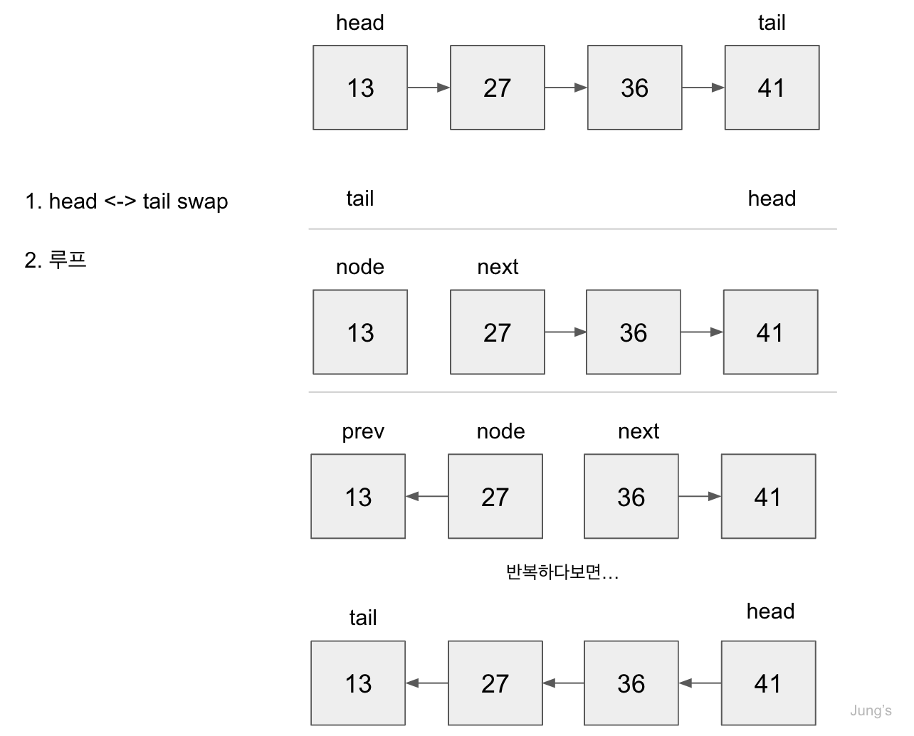

### 1. 단일 연결 리스트(Singly Linked List)란?

- 단일 연결 리스트는 `head` , `tail` , `length` 프로퍼티들을 포함한 자료구조다.
- 단일 연결 리스트는 `node` 들로 구성되어 있으며, 각각의 `node` 는 `value` 와 다른 노드나 null을 향한 `pointer` 를 갖고 있다.
- 연결 리스트의 특징
  - 연결 리스트는 인덱스가 없다. ↔️ 배열은 인덱스가 있다.
  - 연결 리스트는 무작위 접근이 불가능하다. 특정 노드를 찾으려면 첫 노드에서부터 포인터를 통해 특정 노드까지 차례대로 순회해야 한다. <br/> 그렇기 때문에 탐색의 시간복잡도는 `O(N)`이다
    <br/> ↔️ 배열은 원하는 인덱스의 요소에 접근이 빠르게 가능하다.
  - 연결 리스트는 노드와 포인터로 구성되어 있다. 따라서 노드의 삽입이나 삭제는 그 노드의 앞 뒤 노드에만 영향을 미친다.
    <br/> ↔️ 배열은 요소의 삽입이나 삭제 시, 기존의 모든 요소들이 인덱스를 다시 받아야 하므로 복잡하다.
    - 이러한 이유 때문에 아주 긴 데이터에서 무작위 접근은 하지 않고 저장이나 삭제를 주로 한다면, 배열 대신

### 2. 기본 구조

- Node 클래스의 constructor <br/>
  - 연결 리스트를 구성하는 기본 자료구조인 Node 클래스를 정의하고, 필요한 곳에서 인스턴스화하여 사용한다.
  - 노드의 값은 `this.val`에 할당하고, 다음으로 연결된 노드에 대한 pointer는 `this.next`에 할당한다.
- SinglyLinkedList의 construcotr
  - `head`, `tail`, `length`

```javaScript
class Node {
  constructor(val) {
    this.val = val;
    this.next = null;
  }
}

class SinglyLinkedList {
  constructor() {
    this.head = null; // 리스트의 맨앞
    this.tail = null; // 리스트의 맨뒤
    this.length = 0; // 리스트의 길이
  }
}
```

### 3. push(val)

- 연결 리스트의 `마지막 노드를 추가`한다.

```javaScript
push(val) {
    // 인자로 받은 val을 사용해서 새 노드를 생성한다.
    const newNode = new Node(val);

    // 리스트가 비어있다면, head와 tail이 새로 생성한 노드를 할당한다.
    if (!this.head) {
      this.head = newNode;
      this.tail = this.head;
    } else {
    // head에 값이 있다면, tail과 추가된 새 노드를 연결하기 위해
    // tail의 next를 새로 생성했던 노드로 할당하고,
    // 새로 생성했던 노드를 tail에 할당한다
      this.tail.next = newNode;
      this.tail = newNode;
    }

    // length를 1 증가한다.
    this.length++;

    // 연결리스트를 반환한다. -> this !
    return this;
}
```

### 4. pop()

- 연결리스트 `마지막 노드를 삭제`하고, 삭제한 노드를 리턴한다.

```javaScript
pop() {
    if (!this.head) { // 리스트가 비어있다면, undefined를 반환한다.
        return undefined;
    }

    // 연결리스트 순회
    let current = this.head;
    let newTail = current;
    while (current.next) {  // next가 null이 아닐때까지 순회한다.
      // 반복문이 끝나면, pop된 노드의 직전 노드를 가리키게 된다.
      newTail = current;

      // 반복문이 끝나면, current가 pop될 제일 끝 노드를 가리키게 된다.
      current = current.next;
    }

    // pop된 노드에 대한 연결 제거
    this.tail = newTail;   // 직전 노드를 tail에 할당.
    this.tail.next = null;  // tail의 다음은 없다는 것을 명시.
    this.length--;  // 길이 1 줄이기

    // 만약 줄여진 길이가 0이라면, 아무 노드도 없다는 것이므로 head와 tail에 null 할당한다.
    //-> 조건을 추가하지 않는다면, length가 0인데 head와 tail은 살아있게된다.
    if (this.length === 0) {
      this.head = null;
      this.tail = null;
    }

    // pop된 노드 반환
    return current;
  }
```

### 5. unshift(val)

- 연결 리스트의 `첫번째에 새 노드를 추가`한다.

```javaScript
unshift(val) {
    const newNode = new Node(val);

    // 리스트가 비어있다면, head와 tail이 새로 생성한 노드를 할당한다.
    if (!this.head) {
      this.head = newNode;
      this.tail = this.head;
    }

    // 추가할 노드의 next 포인터가 원래 head를 가리키도록 한다.
    newNode.next = this.head;
    // head에 추가할 노드를 할당한다.
    this.head = newNode;

    this.length++;
    return this;
  }
```

### 6. shift()

- 연결 리스트에서 `첫번째 노드를 제거`한다. === head 삭제!

```javaScript
shift() {
    if (!this.head) return undefined;

    const currentHead = this.head;
    // head의 next를 head로 할당한다.
    this.head = currentHead.next;

    // 길이를 줄인다.
    this.length--;

    // 만약 길이가 0이 되면 tail도 null로 할당한다.
    if (this.length === 0) {
      this.tail = null;
    }
    return currentHead;
  }
```

### 7. get(idx)

- `인자로 넘어온 idx에 해당하는 노드`를 반환한다.
- 리스트상 요소에 할당되어있는 인덱스는 없기때문에, 그 인덱스까지 순회하여 노드를 찾는다.

```javaScript
get(idx) {
    // 입력된 인덱스가 유효한지 체크한다. 음수 X, 길이보다 크면 X
    if (idx < 0 || idx >= this.length) return null;

    // 인덱스와 상응할 변수 정의
    let counter = 0;
    let current = this.head;

    // 찾는 인덱스와 카운터가 같기 전까지
    // current의 next를 반복문을 통해 계속 순회한다.
    while (counter !== idx) {
      current = current.next;
      counter++;
    }

    // 노드 반환
    return current;
  }
```

### 8. set(idx, val)

- `인자로 넘어온 idx에 해당하는 노드를 val에 값으로 변경`한다. -> get()메서드 사용!

```javaScript
set(idx, val) {
    // get 메서드를 사용하여 findNode 해당 인덱스의 노드를 가리키도록 한다.
    const findNode = this.get(idx);

    // 입력된 값을 findNode의 val을 인자로 받은 val로 재할당하고 true를 반환한다.
    if (findNode) {
      findNode.val = val;
      return true;
    }

    // 입력된 idx에 노드가 없으면 false 반환
    return false;
  }
```

### 9. insert(idx, val)

- `특정 위치에 노드를 삽입`한다.

```javaScript
insert(idx, val) {
    // 입력된 인덱스가 유효한지 체크한다.
    if (idx < 0 || idx > this.length) return false;

    // 입력된 인덱스가 길이와 같다면,
    // push 메서드 사용하고 형 변환을 통해 true를 반환한다.
    if (idx === this.length) return !!this.push(val);

    // 입력된 인덱스가 0이라면,
    // unshift 메서드 사용하고 형 변환을 통해 true를 반환한다.
    if (idx === 0) return !!this.unshift(val);

    const newNode = new Node(val);

    // 인덱스의 이전 노드 찾기
    const prev = this.get(idx - 1);

    // 이전 노드의 next 저장
    const temp = prev.next;

    // 이전 노드의 next가 새로 삽입한 노드를 가리키도록 한다.
    prev.next = newNode;

    // 새로 삽입한 노드의 next 포인터가 이전 노드의 원래의 next를 가리키게 한다.
    newNode.next = temp;

    this.length++;
    return true;
  }
```

### 10. remove(idx)

- `특정 위치에 노드를 삭제`한다.

```javaScript
remove(idx) {
    // 입력된 인덱스가 유효한지 체크한다.
    if (idx < 0 || idx >= this.length) return undefined;

    // 입력된 인덱스가 0이면 shift 메서드를 사용한다.
    if (idx === 0) return this.shift();

    // 입력된 인덱스가 끝 인덱스와 같다면 pop 메서드를 사용한다.
    if (idx === this.length - 1) return this.pop();

    // 인덱스의 이전 노드 찾기
    const prevNode = this.get(idx - 1);

    // removed 변수는 이전 노드의 next. 즉, 인덱스의 해당하는 노드로 할당.
    // 반환해야하는 변수임!
    const removed = prevNode.next;

    prevNode.next = removed.next; // 삭제할 노드의 next로 이전 노드의 next를 변경해준다.

    this.length--;
    return removed;
  }
```

### 11. reverse()

- 리스트의 노드 순서를 `역`으로 연결한다. -> 순서 뒤집기!

<div style="width: 500px; margin: auto;">

</div>

```javaScript
reverse() {
    // node 변수가 head를 가리키게 한다.
    let node = this.head;

    // head는 tail을 가리키게 한다.
    this.head = this.tail;
    // tail은 node 변수에 저장된 기존의 head를 가리키게 한다.
    this.tail = node;
    // head <-> tail 변경

    let next;
    let prev = null;
    for (let i = 0; i < this.length; i++) { // 리스트 길이만큼 루프
      next = node.next;
      node.next = prev;
      prev = node;
      node = next;
    } // -> 뒤집어진다.

    return this; //리스트 반환
  }
```

### 12. 시간복잡도

- 삽입(첫번째 혹은 마지막) : `O(1)`
  ↔️ 배열은 맨 앞 노드 추가는 `O(N)`
- 제거
  - 첫번째 노드를 제거하면 `O(1)` `shift()`
  - 마지막 노드를 제거하면 `O(N)` `pop()` //직전노드를 찾느라 순회해야해서
- 탐색 : `O(N)`
- 접근 : `O(N)` ↔️ 배열에서는 인덱스로 접근을 하므로 O(1)

### 요약

- 단일 연결 리스트는 노드로 구성되어있고, head, tail, length를 가지고 있는 자료구조다.
  - 노드는 value와 다음 노드를 가리키는 포인터를 가지고 있다.
- 인덱스 위치 정보를 가지고 있지 않아, 쉽게 바로 인덱스를 이용해서 접근 할 수 없다.
- 마지막 노드를 추가/삭제하는 메소드 : push() / pop()
- 첫번째 노드를 추가/삭제하는 메소드 : unshift() / shift()
- 특정 위치에 노드를 가져오거나 내용을 변경하는 메소드 : get() / set()
- 특정 위치에 노드를 추가/삭제하는 메소드 : insert() / remove()
- 리스트의 순서를 역으로 변경하는 메소드 : reverse()
- **임의 접근에 대한 필요성의 별로 없고, 삽입/삭제의 시간이 중요할 때 적절하다.**
