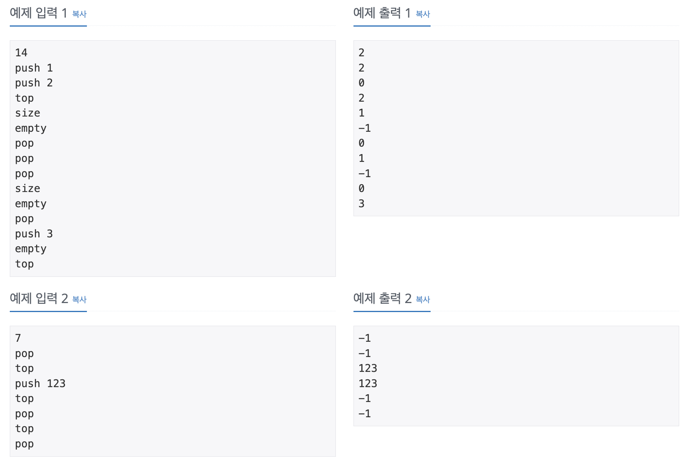

스택 공부 후 백준에서 문제를 풀었다. 도저히 단순 문제에 O(n), 메모리도 크게 잡아먹지 않는데, 시간초과가 떠서 한번에 통과하지 못했다. 처음 접해본 이유라 기록하고자 포스팅한다. ~~(바보멍청이)~~

[백준 10828번 문제](https://www.acmicpc.net/problem/10828)

### 1. 문제

정수를 저장하는 스택을 구현한 다음, 입력으로 주어지는 명령을 처리하는 프로그램을 작성하시오.

명령은 총 다섯 가지이다.

push X: 정수 X를 스택에 넣는 연산이다. <br/>
pop: 스택에서 가장 위에 있는 정수를 빼고, 그 수를 출력한다. 만약 스택에 들어있는 정수가 없는 경우에는 -1을 출력한다. <br/>
size: 스택에 들어있는 정수의 개수를 출력한다. <br/>
empty: 스택이 비어있으면 1, 아니면 0을 출력한다. <br/>
top: 스택의 가장 위에 있는 정수를 출력한다. 만약 스택에 들어있는 정수가 없는 경우에는 -1을 출력한다. <br/>

### 2. 입력 / 출력

- 입력 <br/>
  첫째 줄에 주어지는 명령의 수 N (1 ≤ N ≤ 10,000)이 주어진다. 둘째 줄부터 N개의 줄에는 명령이 하나씩 주어진다. 주어지는 정수는 1보다 크거나 같고, 100,000보다 작거나 같다. 문제에 나와있지 않은 명령이 주어지는 경우는 없다.
- 출력 <br/>
  출력해야하는 명령이 주어질 때마다, 한 줄에 하나씩 출력한다.

### 3. 예제

<div style="width: 800px; margin: auto;">

</div>

### 4. 풀이

완전 쉬운 문제였다. 루프안에서 switch로 그에 맞는 명령어를 수행해서 log로 찍어주면 되는문제면서 명령도 어렵지 않았다.

- 첫번째 코드

```javaScript
const fs = require('fs')
const filePath =
  process.platform === 'linux' ? '/dev/stdin' : './backjoon/10828_test.txt'
const input = fs.readFileSync(filePath).toString().split('\n')

const stack = [] //저장할 스택 정의

for (let i = 1; i <= input[0]; i++) {
  const command = input[i].split(' ') //push 뒤에 넣을 문자를 얻기 위해 공백으로 split

  switch (command[0]) { //switch
    case 'push':
      stack.push(command[1])
      break
    case 'pop':
      console.log(stack.length === 0 ? -1 : stack.pop())
      break
    case 'top':
      let topIdx = stack[stack.length - 1]
      console.log(topIdx === undefined ? -1 : topIdx)
      break
    case 'size':
      console.log(stack.length)
      break
    case 'empty':
      console.log(stack.length !== 0 ? 0 : 1)
      break
  }
}
```

그런데,,, <br/>
시간초과가 떴다. 이유는 루프를 돌 때마다 switch안에서 찍은 console이 문제였다.

https://stackoverflow.com/questions/2934509/exclude-debug-javascript-code-during-minification
👉🏻 console.log는 디버깅용으로 쓰는 함수라서 사용할 때 속도가 저하될 수 있다고 한다. => 즉, 매 for문 마다 console.log()를 돌리는 것은 비효율적이다! ~~멍충멍충~~
<br/><br/>

- 두번째 수정 코드 <br/>
  for문이 끝난 후 한번에 join을 사용해서 log를 찍었다.

```javaScript
const fs = require('fs')
const filePath =
  process.platform === 'linux' ? '/dev/stdin' : './backjoon/10828_test.txt'
const input = fs.readFileSync(filePath).toString().split('\n')

const stack = []
const answer = [] //정답을 담는 배열 선언

for (let i = 1; i <= input[0]; i++) {
  const command = input[i].split(' ')

  switch (command[0]) {
    case 'push':
      stack.push(command[1])
      break
    case 'pop':
    //로그 대신 배열에 push
      answer.push(stack.length === 0 ? -1 : stack.pop())
      break
    case 'top':
      let topIdx = stack[stack.length - 1]
      answer.push(topIdx === undefined ? -1 : topIdx)
      break
    case 'size':
      answer.push(stack.length)
      break
    case 'empty':
      answer.push(stack.length !== 0 ? 0 : 1)
      break
  }
}

console.log(answer.join('\n'))
```
