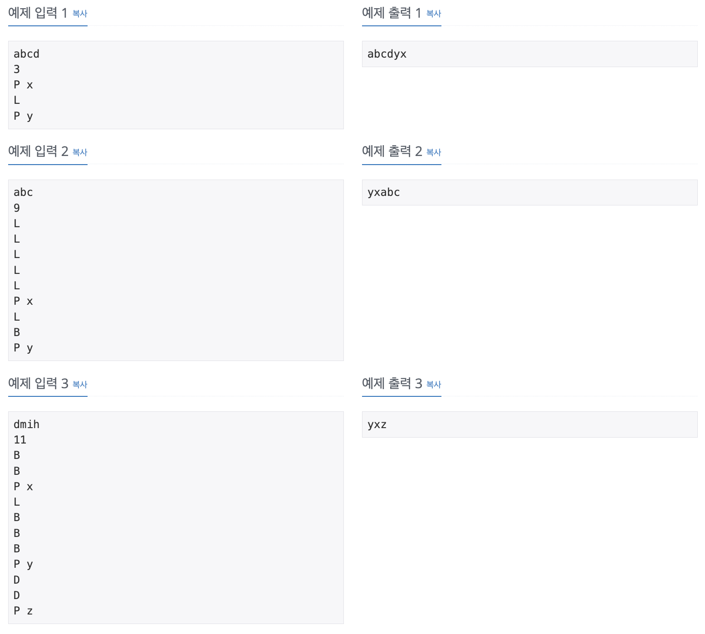
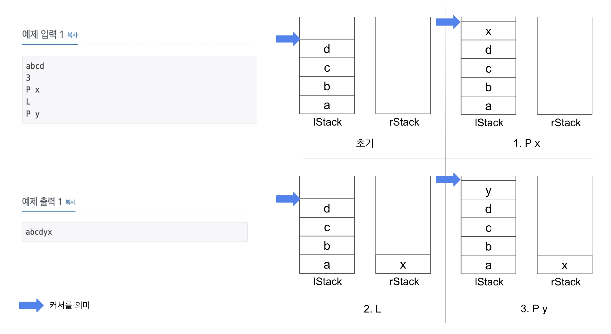

두 개의 스택을 이용해서 해당 문제를 풀었다.

[문제 링크](https://www.acmicpc.net/problem/1406)

### 성능 요약

메모리: 104604 KB, 시간: 568 ms

### 분류

자료 구조, 연결 리스트, 스택

### 문제 설명

<p>한 줄로 된 간단한 에디터를 구현하려고 한다. 이 편집기는 영어 소문자만을 기록할 수 있는 편집기로, 최대 600,000글자까지 입력할 수 있다.</p>

<p>이 편집기에는 '커서'라는 것이 있는데, 커서는 문장의 맨 앞(첫 번째 문자의 왼쪽), 문장의 맨 뒤(마지막 문자의 오른쪽), 또는 문장 중간 임의의 곳(모든 연속된 두 문자 사이)에 위치할 수 있다. 즉 길이가 L인 문자열이 현재 편집기에 입력되어 있으면, 커서가 위치할 수 있는 곳은 L+1가지 경우가 있다.</p>

<p>이 편집기가 지원하는 명령어는 다음과 같다.</p>

<table class="table table-bordered" style="width:100%">
	<tbody>
		<tr>
			<th style="width:20%">L</th>
			<td style="width:80%">커서를 왼쪽으로 한 칸 옮김 (커서가 문장의 맨 앞이면 무시됨)</td>
		</tr>
		<tr>
			<th>D</th>
			<td>커서를 오른쪽으로 한 칸 옮김 (커서가 문장의 맨 뒤이면 무시됨)</td>
		</tr>
		<tr>
			<th>B</th>
			<td>커서 왼쪽에 있는 문자를 삭제함 (커서가 문장의 맨 앞이면 무시됨)<br>
			삭제로 인해 커서는 한 칸 왼쪽으로 이동한 것처럼 나타나지만, 실제로 커서의 오른쪽에 있던 문자는 그대로임</td>
		</tr>
		<tr>
			<th>P <span>$</span></th>
			<td><span>$</span>라는 문자를 커서 왼쪽에 추가함</td>
		</tr>
	</tbody>
</table>

<p>초기에 편집기에 입력되어 있는 문자열이 주어지고, 그 이후 입력한 명령어가 차례로 주어졌을 때, 모든 명령어를 수행하고 난 후 편집기에 입력되어 있는 문자열을 구하는 프로그램을 작성하시오. 단, 명령어가 수행되기 전에 커서는 문장의 맨 뒤에 위치하고 있다고 한다.</p>

### 입력

 <p>첫째 줄에는 초기에 편집기에 입력되어 있는 문자열이 주어진다. 이 문자열은 길이가 N이고, 영어 소문자로만 이루어져 있으며, 길이는 100,000을 넘지 않는다. 둘째 줄에는 입력할 명령어의 개수를 나타내는 정수 M(1 ≤ M ≤ 500,000)이 주어진다. 셋째 줄부터 M개의 줄에 걸쳐 입력할 명령어가 순서대로 주어진다. 명령어는 위의 네 가지 중 하나의 형태로만 주어진다.</p>

### 출력

 <p>첫째 줄에 모든 명령어를 수행하고 난 후 편집기에 입력되어 있는 문자열을 출력한다.</p>

### 예제

<div style="width: 800px; margin: auto;">

</div>

### 풀이

위에 적었다 싶이 두 개의 스택을 이용했다.
커서의 위치에 따라 왼쪽, 오른쪽 스택을 정의했고, 명령어에 따라 push, pop() 해줬다. <br/>
오른쪽 스택은 역순으로 쌓였기 때문에 reverse를 해서 concat해줬다.
<br/>
주의 ! <br/>
입력 받은 타입체크는 필수로. 처음 for문 비교부분에 `input[1] + 1`해줬다가 split에서 에러가 났다. 이유는 input[1]+1 31로 for문이 만족할때까지 돌텐데 input에 그 이상 인덱스에 담는 값이 없어서다 👉🏻 Number로 형변환해서 더해주자 !



```javaScript
const fs = require('fs')
const filePath =
  process.platform === 'linux' ? '/dev/stdin' : './backjoon/1406_test.txt'
const input = fs.readFileSync(filePath).toString().split('\n')

const lstack = input[0].split('')
//입력받은 문자 배열에 넣기
//-> split에 인자에 빈 single quote를 넣어주면 문자 각각 그대로 배열이 된다.
const rstack = []

for (let i = 2; i <= Number(input[1]) + 1; i++) {
  const command = input[i].split(' ')

  switch (command[0]) {
    case 'L': //왼쪽 커서 옮기기
      if (lstack.length !== 0) {
        rstack.push(lstack.pop())
      }
      break
    case 'D': //오른쪽 커서 옮기기
      if (rstack.length !== 0) {
        lstack.push(rstack.pop())
      }
      break
    case 'B': //커서 왼쪽에 문자 삭제
      if (lstack.length !== 0) {
        lstack.pop()
      }
      break
    case 'P': //커서 왼쪽에 문자 추가
      lstack.push(command[1])
      break
  }
}

console.log(lstack.concat(rstack.reverse()).join(''))
```
