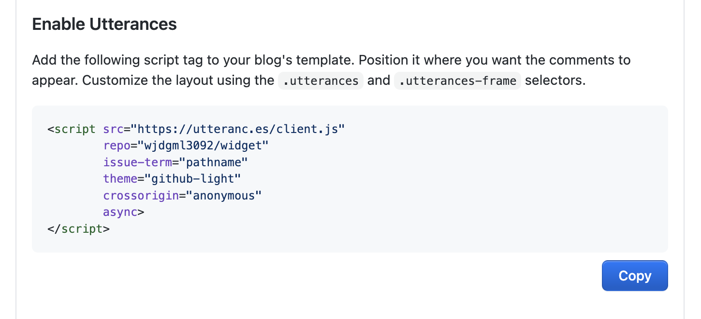
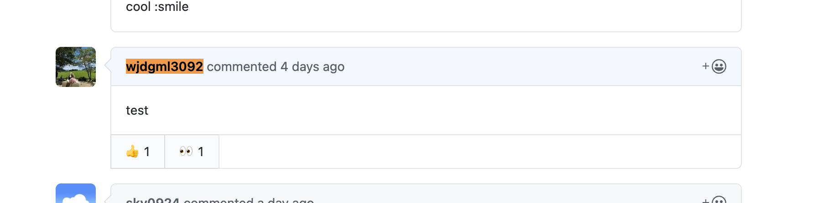
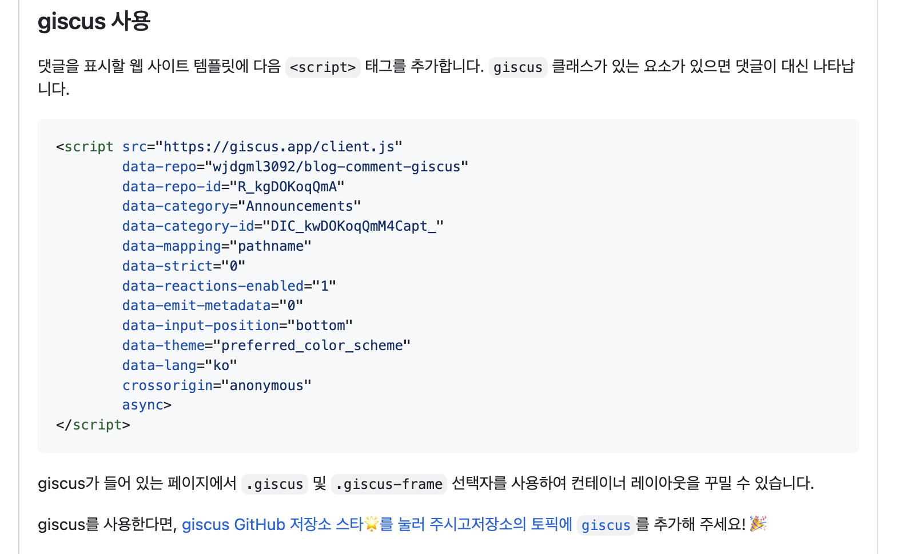
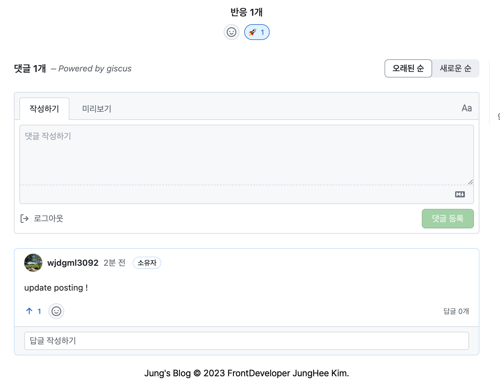

### 개요

구현된 정적 사이트에 댓글 기능을 다는 방법은 여러가지지만 처음에는 utterances를 이용해서 배포했다. 며칠 후 giscus를 알게되어 변경했다. <br/> giscus로 변경한 이유는 바로 아래서 설명하겠다.

### utterances VS giscus

두 서비스 다 GitHub API 를 활용한 서비스인데, utterances는 `Issues API` 를 사용하고, giscus는 `Discussions API` 를 사용한다. giscus는 utterances를 기반으로 만들어진 라이브러리여서인지, 적용하는 방식은 두 서비스가 유사하다.
또한 <b>사용 방법이 매우 쉽다. </b>

|                | utterances | giscus |
| -------------- | ---------- | ------ |
| 댓글 기능      | O          | O      |
| 대댓글 기능    | X          | O      |
| 글 리액션 기능 | X          | O      |

위 표에서 써져있는 것처럼 utterances에서 giscus로 변경한 이유는 대댓글기능과 글 리액션 기능이다.

### utterances 적용

1. <b>설정</b>

   - Github에 Utterances 애플리케이션을 추가해주고, 블로그 레포지토리에 권한 설정 → [설치 링크](!https://github.com/apps/utterances)

   - 모든 레포지토리에 권한을 줘도 상관없지만, 댓글을 저장할 레포지토리를 하나 생성한 후에 이 레포지토리에만 권한을 부여하는 것을 추천한다.

2. <b>구현</b>
[공식문서](!https://utteranc.es/)의 Configuration 섹션을 쭉 따라가면서 설정해주면 마지막에 script 태그를 하나 만들어준다. <br/>
(매핑 기준은 Issue title contains page pathname를 선택했다.)

   <div>
        
    </div>
"Position it where you want the comments to appear" 코멘트가 위치할 곳에 가져다 붙이기만 하면 된다 <br/> 라고는 적혀있지만,  React 환경에서는 script 태그를 가져다 붙이는 것으로는 적용되지 않는다. <u>useEffect 를 사용해 초기화 시 동적으로 설정하게끔 해주어야 한다.</u> <br/>

```tsx
import React, { createRef, useEffect } from 'react'

const src = 'https://utteranc.es/client.js'
const repo = 'wjdgml3092/blog-comments'

type UtterancesAttributesType = {
  src: string
  repo: string
  'issue-term': string
  label: string
  theme: string
  crossorigin: string
  async: string
}

const CommentWidget = () => {
  const element = createRef<HTMLDivElement>()

  useEffect(() => {
    if (element.current === null) return

    const utterances: HTMLScriptElement = document.createElement('script')

    const attributes: UtterancesAttributesType = {
      src,
      repo,
      'issue-term': 'pathname',
      label: 'Comment',
      theme: `github-light`,
      crossorigin: 'anonymous',
      async: 'true',
    }

    Object.entries(attributes).forEach(([key, value]) => {
      utterances.setAttribute(key, value)
    })

    element.current.appendChild(utterances)
  }, [])

  return <div ref={element} />
}

export default CommentWidget
```

댓글 기능을 초기화해주는 컴포넌트를 하나 만들어주고 `postContent(댓글을 넣을)`부분 아래에 붙여주면 끝이다.

<br/>

3. <b>완성</b>

<div>
    
</div>

<br/>

### giscus 적용

utterances 유사!

1. <b>설정</b>

   - 댓글이 작성될 레포지토리 생성 (꼭, 댓글 기능을 적용하려는 프로젝트의 레포지토리가 아니어도 된다.)
   - 해당 레포지토리 - [Settings] - [Features] - [Discussions] 기능을 사용하기로 체크한다.
   - 댓글이 작성될 카테고리를 생성하거나 혹은 있는 카테고리를 사용해도 된다.
   - [giscus 설치](!https://github.com/apps/giscus)

2. <b>구현</b>
   [공식문서](!https://giscus.app/ko/)의 Configuration 섹션을 쭉 따라가면서 설정해주면 마지막에 script 태그를 하나 만들어준다. <br/>(Discussion 카테고리는 만든 카테고리가 있다면 그걸로 선택, 메인 포스트에 리액션 반응 선택)

    <div>
         
   </div>
    <u>giscus도 만들어진 스크립트를 갖다 쓸 수는 없다.</u> <br/>

   ```tsx
   import styled from '@emotion/styled'
   import React, { createRef, useEffect } from 'react'

   const CommentWrapper = styled.div`
     width: 768px;
     margin: auto;

     @media (max-width: 768px) {
       width: 100%;
       padding: 15px;
     }
   `

   const src = 'https://giscus.app/client.js'

   type GiscusAttributesType = {
     src: string
     'data-repo': string
     'data-repo-id': string
     'data-category': string
     'data-category-id': string
     'data-mapping': string
     'data-strict': string
     'data-reactions-enabled': string
     'data-emit-metadata': string
     'data-input-position': string
     'data-theme': string
     'data-lang': string
     crossorigin: string
     async: string
   }

   const CommentWidget = () => {
     const element = createRef<HTMLDivElement>()

     useEffect(() => {
       if (element.current === null) return

       const giscus: HTMLScriptElement = document.createElement('script')

       const attributes: GiscusAttributesType = {
         src,
         'data-repo': 'wjdgml3092/wjdgml3092.github.io',
         'data-repo-id': 'R_kgDOJ0fPzg',
         'data-category': 'Giscus',
         'data-category-id': 'DIC_kwDOJ0fPzs4CapzG',
         'data-mapping': 'pathname',
         'data-strict': '0',
         'data-reactions-enabled': '1',
         'data-emit-metadata': '0',
         'data-input-position': 'top',
         'data-theme': 'preferred_color_scheme',
         'data-lang': 'ko',
         crossorigin: 'anonymous',
         async: 'true',
       }

       Object.entries(attributes).forEach(([key, value]) => {
         giscus.setAttribute(key, value)
       })

       element.current.appendChild(giscus)
     }, [])

     return <CommentWrapper ref={element} />
   }

   export default CommentWidget
   ```

 <br/>

3. <b>완성</b>
<div>
    
</div>

 <br/>

### 마무리

giscus를 빨리 알았다면 좋았을텐데 검색을 하면 utterances 관련 글이 많이 뜬다. 그래서 이 두 가지의 차이점과 각각 적용방법을 포스팅하면 좋겠다고 생각했다. 이상 !🫡
