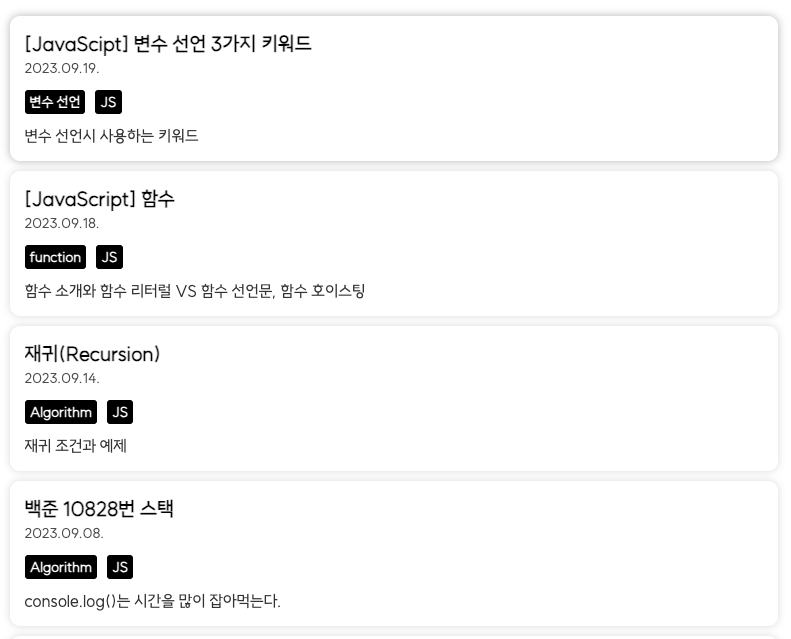
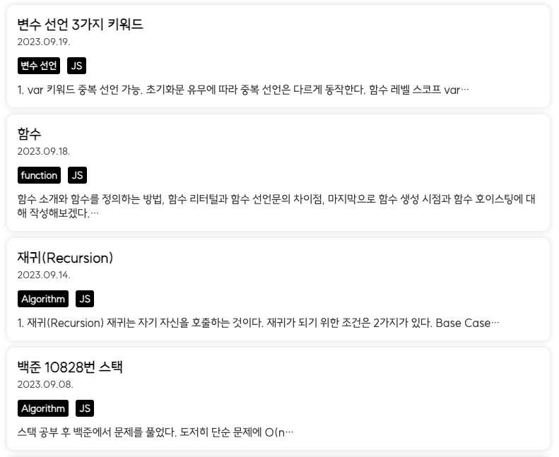

excerpt를 추가하기 전 블로그는 직접 글을 작성할 때마다 summary값을 넣었고, 요약이 생각나지 않았던 글들도 있다. <br/>
이런 불편함으로 인해 css처리를 해보려다가 나은 방법이 있을까 하고,
검색을 해봤더니 Graphql에서 excerpt항목을 가져오면 해결하는 것이 있었다. <br/>
현재 쿼리에서 추가를 하고 타입을 재정의하는 과정을 포스팅 하고자 한다.

<span style="font-size: 12px; color: #c8c8c8">excerpt 추가하기 전 글 리스트</span>

<div style="width: 60%;">
        
</div>

### 1. 시작하기

- `React` / `Emotion` / `TypeScript`
- 게츠비를 만들 당시 참고했던 [인프런 강의](https://www.inflearn.com/course/gatsby-%EA%B8%B0%EC%88%A0%EB%B8%94%EB%A1%9C%EA%B7%B8/dashboard)가 있다. 해당 강의를 보고 하신 분들은 나와 디렉토리 구조 등을 비슷할 것이니 쉽게 할 수 있을 것이다.

- 수정파일 목록
  - 수정한 파일은 별로 없다.
  ```powershell
  components
      ㄴ Main
          ㄴ PostItem.tsx //리스트 안에 각 포스트 컴포넌트
          ㄴ PostList.tsx //리스트 컴포넌트
      ㄴ pages
          ㄴ index.tsx //리스팅 페이지 파일
      ㄴ types
          ㄴ Post.tsx //타입 정의 파일
  ```

### 1. 쿼리 추가

- pages/index.tsx 수정

```graphql
export const getPostList = graphql`
  query getPostList {
    site {
      siteMetadata {
        title
        description
        siteUrl
      }
    }
    allMarkdownRemark(
      sort: { order: DESC, fields: [frontmatter___date, frontmatter___title] }
    ) {
      edges {
        node {
          excerpt(pruneLength: 80)
          id
          fields {
            slug
          }
          frontmatter {
            title
            date(formatString: "YYYY.MM.DD.")
            categories
          }
        }
      }
    }
    file(name: { eq: "jeju" }) {
      childImageSharp {
        gatsbyImageData(width: 200, height: 200)
      }
      publicURL
    }
  }
`
```

- `allMarkdownRemark` 는 GraphQL 프로퍼티인데 모든 마크다운 노드를 의미한다. 페이지 레벨의 gql 쿼리를 통해 한꺼번에 모든 포스트를 요청해서 가져오지만 원하는 정보만 가져올 수 있다.
- `allMarkdownRemark` 프로퍼티 밑에 `edges.node`가 있다. 이 node가 각 md 파일을 의미하고, 여기에 적혀진 쿼리대로 요청한 정보를 가져오게 된다. node 아래에 <span class='highlight'>**excerpt 를 넣어주면 된다!**</span>
- 원하는 글자 수까지 잘라낼 수도 있다. 기본적으로 140자를 잘라 데이터를 보내주지만, 원할 때는 위와 같이 작성하면 된다. 나는 지저분해보여 좀 짧게 가져왔다. `(pruneLength: 80, truncate: true)` 또한 `excerpt_separator` 세퍼레이터도 설정가능하다.
  > `truncate: true` 해주는 이유는? (09.28 추가) <br/> > `pruneLength`의 경우 `non lation language`에서는 동작하지 않는다. 한글만 사용했을때는 pruneLength를 하면, ...으로 말을 잇지 못한다. <br/>09.28에 작성한 글에서 한글만 있다보니 바로 ... 줄임표가 생겨 `truncate` 추가로 해결했다. 해결방법으로 `excerpt_separator`도 있지만 모든 글에 항상 내가 원하는 부분에서 자를수 있도록 작성해야하는 번거로움이 있어 `truncate`를 추천한다.

### 2. Post.ts 수정

정의한 `PostListItemType`에 `excerpt`만 추가하면 끝

```typeScript
export type PostListItemType = {
  node: {
    excerpt: string //추가
    id: string
    fields: {
      slug: string
    }
    frontmatter: PostFrontmatterType
  }
}
```

### 3. PostList.tsx 수정

- pros로 전달받은 posts를 커스텀훅 `useInfiniteScroll`통해 가공한 postList를 가지고 `map`을 돌리면서 글 하나씩 뿌려주면 된다.
- 이때 <u>PostItem 컴포넌트 props에 excerpt를 추가</u>해서 보내주면 된다. (물론, map 돌릴 때 excerpt도 같이 꺼내주고!)

```typeScript
const PostList = ({ selectedCategory, posts }: PostListProps) => {
  const { containerRef, postList }: useInfiniteScrollType = useInfiniteScroll(
    selectedCategory,
    posts,
  )

  return (
    <PostListWrapper ref={containerRef}>
      {postList.map(
        ({
          node: {
            excerpt, //꺼내주고(추가)
            id,
            fields: { slug },
            frontmatter,
          },
        }: PostListItemType) => (
          <PostItem excerpt={excerpt} {...frontmatter} link={slug} key={id} /> //추가-props
        ),
      )}
    </PostListWrapper>
  )
}
```

### 3. PostItem.tsx 수정

- 파일 위에서 받을 props 타입을 정의한 부분이 있는데 해당 부분에 `excerpt`도 받을 수 있게 재정의해준다.
- props에 추가해주고, 뿌려줄 부분에 넣어주기만 하면 끝이다.

```typeScript
//기존 정의한 부분
type PostItemProps = PostFrontmatterType & { link: string }

//변경 부분
type PostItemProps = PostFrontmatterType & { link: string } & {
  excerpt: string
}

const PostItem = ({
  title,
  date,
  categories,
  link,
  excerpt, //같이 받아주고
}: PostItemProps) => {
  return (
    <PostItemWrapper to={link}>
      <PostItemContent>
        <Title>{title}</Title>
        <Date>{date}</Date>
        <Category>
          {categories.map(category => (
            <CategoryItem key={category}>{category}</CategoryItem>
          ))}
        </Category>
        <Excerpt>{excerpt}</Excerpt>/**값 넣어주면 끝!*/
      </PostItemContent>
    </PostItemWrapper>
  )
}

export default PostItem
```

### 끝

위 과정을 순서대로 했다면 아래 사진과 같이 excerpt가 추가되어 설정한 글자수까지 잘려서 보이는걸 확인할 수 있다. 👍🏻

<div>
    
</div>

<br/>
