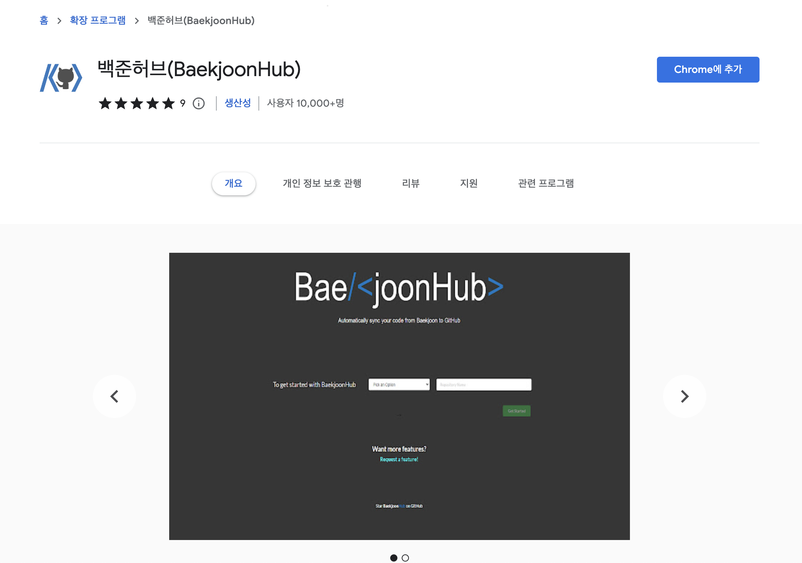
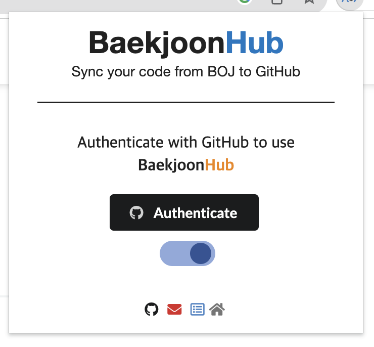
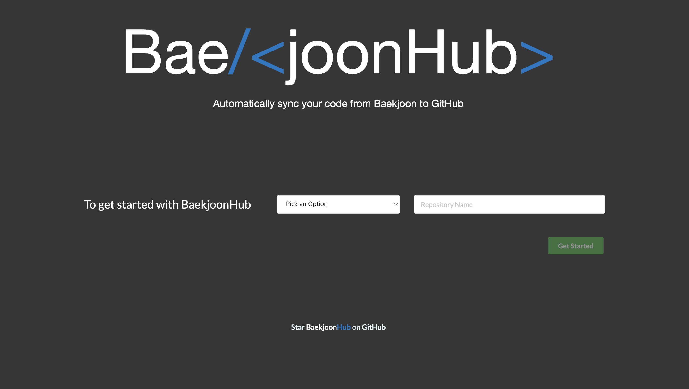
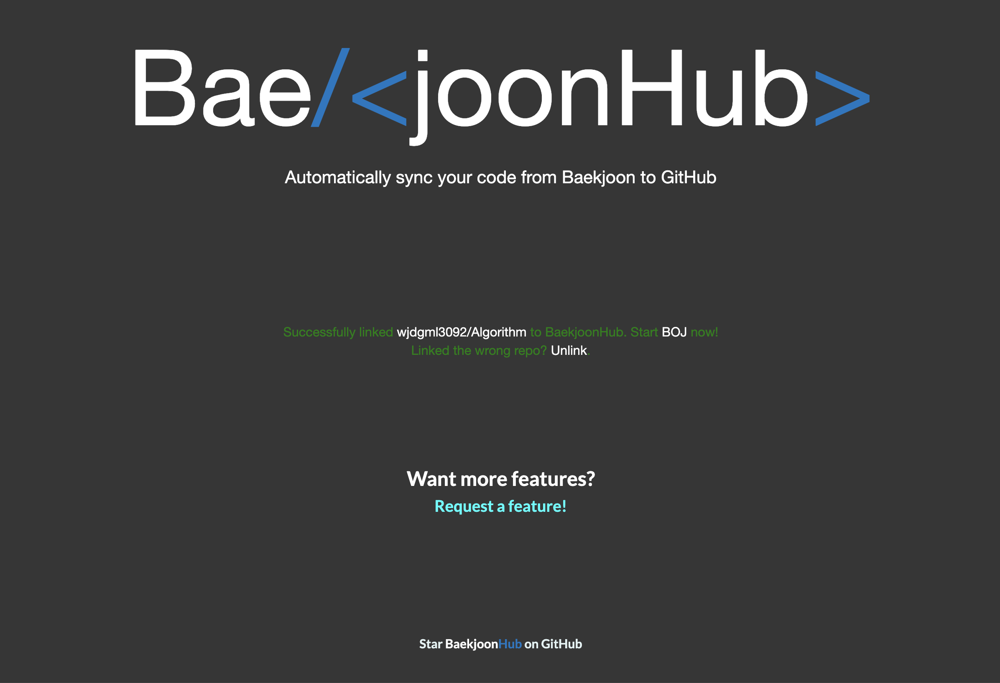
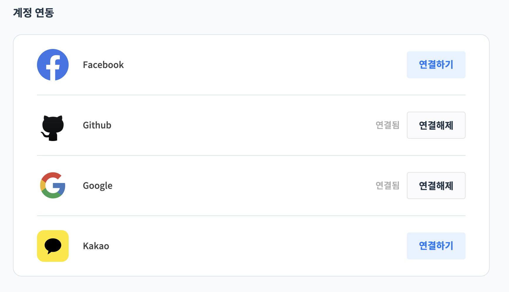

**자동으로** 백준, 프로그래머스 코드 GitHub Commit하는 방법을 공유하고자 해당 글을 작성하게 되었습니다!
 
~~\*나중에 세팅다시할 때 봐야지😉~~

### 1. 백준 허브 Install

제일 먼저, 크롬 확장프로그램에 들어가서 백준 허브를 설치해야합니다.

백준 허브는 백준이랑 프로그래머스에서 제출한 코드를 깃허브에 자동으로 커밋해주는 역할을 수행하고 있습니다.

[설치 링크 바로가기](https://chrome.google.com/webstore/detail/%EB%B0%B1%EC%A4%80%ED%97%88%EB%B8%8Cbaekjoonhub/ccammcjdkpgjmcpijpahlehmapgmphmk?hl=ko)

### 2. 백준 허브 연결 과정

- 설치 후 GitHub 인증을 진행합니다.

- SetUpHook을 누르면 아래와 같은 사이트로 연결됩니다.
   
  레포지토리를 새로 만들거나 혹은 생성하는 옵션이 있습니다.

저는 여기서 <U>Algorithm</U> 이름으로 레포지토리를 생성하였습니다.

 
기본 과정은 끝났고, 연동하면 끝입니다.

### 3. 프로그래머스 <-> GitHub 연동

마이페이지 > 계정관리 > 하단 부분에 아래 이미지처럼 계정 연동부분이 있습니다.  
GitHub와 연동만 해주면 끝입니다!

### 4. 백준 <-> GitHub 연동

백준은 연동과정이 없습니다. 연동하지 않아도 문제 제출 시 자동 Commit 됩니다. 👍🏻

### 마무리

이렇게 자동으로 코딩테스트 연습문제를 GitHub에 커밋하는 방법을 기록해봤습니다.  
이건 정말 혁명,,🫶🏻  

  
