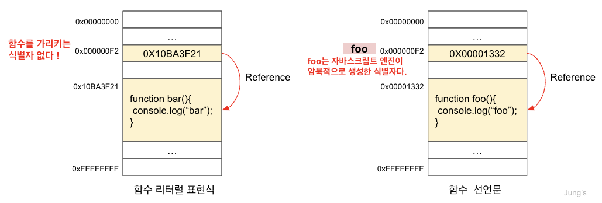
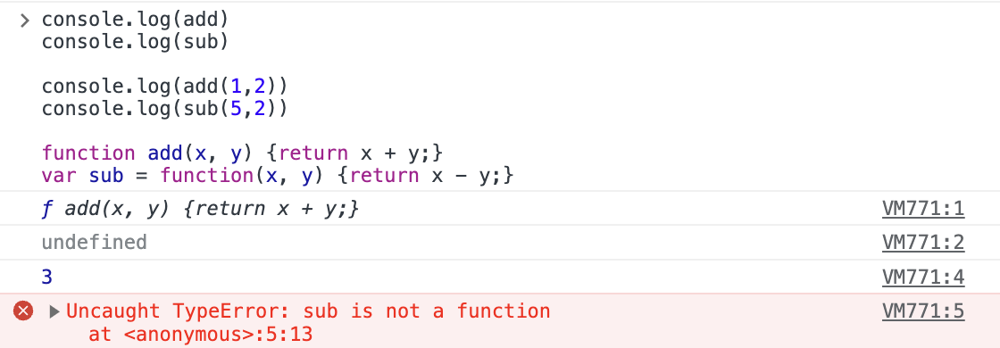

함수 소개와 함수를 정의하는 방법, 함수 리터털과 함수 선언문의 차이점, 마지막으로 함수 생성 시점과 함수 호이스팅에 대해 작성해보겠다.

### 1. 함수란?

- 일련의 과정을 문(statement)으로 구현하고, 코드 블록으로 감싸서 하나의 실행 단위로 정의한 것이다.
- 중복된 코드를 줄이고, 코드의 가독성을 향상시키기 위해 사용한다.
- 함수 내부로 입력을 전달받는 변수를 `매개변수(parameter)`, 입력을 `인수(argument)`, 출력을 `반환값(return value)`이라 한다. 또한 함수는 값이며, 여러개 존재할 수 있어 구별하기 위해 식별자인 `함수 이름`을 사용할 수 있다. 함수는 `함수 정의`를 통해 생성한다.
  ```javaScript
  //add : 함수 이름
  //x, y : 매개변수(parameter)
  function add(x,y){ //-->여기서부터
  //함수 몸체
  return x+y; //반환값(return value).
  } //-->여기까지 함수 정의
  add(1,2) //1,2 : 인수(argument)
  //함수 호출
  ```

### 2. 함수 정의

정의된 함수는 자바스크립트 엔진에 의해 평가되어 함수 객체가 된다.
|<center>함수 정의 방식</center>|<center>example</center>
|--||:---------------|
|함수 선언문|function add (x,y){ <br/>&nbsp;&nbsp;return x+y; <br/>}|
|함수 표현식|var add = function(x,y){<br/>&nbsp;&nbsp;return x+y;};|
|Function 생성자 함수|var add = new Function('x','y','return x+y');|
|화살표 함수(ES6)|var add = (x,y) => x+y;|

- `함수 선언문`
  - 함수 이름을 생략할 수 없다. <b>함수 선언문은 표현식이 아닌 문</b>이다.
- `함수 표현식`
  - 함수는 객체 타입의 값이다. 자바스크립의 함수는 값처럼 변수에 할당할 수도 있고, 프로퍼티 값이 될 수도 있으며 배열의 요소가 될수도 있다. &rarr; 이처럼 값의 성질을 갖는 객체를 <b>일급 객체</b>라 한다.
  - 즉, 일급 객체이므로, 함수 리터럴로 생성한 함수 객체를 변수에 할당할 수 있다.
  - 표현식으로 작성한다면 표 예시와 같다.
- `Function 생성자 함수`
  - 기본 제공하는 빌트인 함수인 Function 생성자 함수에 매개변수와 몸체를 전달하면서 new 연산자와 함께 호출하면 함수 객체를 생성해서 반환한다.(new 없어도 동일)
  - 하지만, Function 생성자 함수로 함수를 생성하는 방식은 일반적이지도, 바람직하지도 않다. (클로저를 생성하지 않고, 함수 선언문 혹은 함수 표현식으로 생성한 함수와 다르게 동작한다.)
- `화살표 함수`
  - ES6에서 도입되었다.
  - function 키워드 대신 화살표를 사용해 간략한 방법으로 함수를 선언하는 것이다.
  - 항상 익명 함수(함수 이름 존재X)로 정의한다.

### 3. 함수 리터럴

- 자바스크립트의 함수는 객체 타입의 값으로, 함수 리터럴로 생성할 수 있다.
  함수 리터럴 구성
  |<center>구성 요소</center>|<center>설명</center>
  |:-------||:---------------|
  |함수 이름|<ul><li>함수 이름은 식별자다.</li><li><span style="font-weight: 700; background-color: #fff5b1">함수 이름은 함수 몸체 내에서만 참조할 수 있는 식별자다</span></li><li>함수 이름은 생략 할 수 있다</li></ul>|
  |매개변수 목록|<ul><li>0개 이상의 매개변수를 소괄호로 감싸고 쉼표로 구분한다.<li>각 매개변수에는 함수 호출 시 지정한 인수가 순서대로 할당한다.</li><li>매개변수는 함수 몸체 내에서 변수와 동일하게 취급된다.</li></ul>|
  |함수 몸체|<ul><li>함수 몸체는 함수 호출에 의해 실행된다.</li></ul>|
- 함수는 객체지만 일반 객체와는 다르다.
  - 일반 객체는 호출 X, 함수 객체만의 고유한 프로퍼티를 갖는다.

### 4. 함수 선언문 VS 함수 리터럴

<u>함수 선언문과 함수 리터럴은 형태가 동일하다.</u> 문맥에 따라 함수 선언문이여야 하는지, 함수 리터럴이여야 하는지를 판단한다.

```javaScript
// 함수 리터럴
var add = function add(x, y) {
return x + y;
}

// 함수 호출
console.log(add(1, 2)); // 3
```

위에서 function add를 함수 선언문이라고 가정하면, 할당 연산자에 의해서 변수에 값이 할당될 수 있어야 한다.

즉 함수 선언문은 값으로 평가될 수 있어야 한다. 하지만 함수 선언문은 표현식이 아닌 문, 즉 값으로 평가될 수 없으므로 해당 자리에는 함수 선언문이 올 수 없다.

따라서 값으로 평가될 수 있는 함수 리터럴이 와야하는 자리이므로, 자바스크립트는 function add를 함수 표현식으로 해석한다.

### 4-1. 함수 선언문과 함수 리터럴의 내부 동작 차이

```javaScript
// 함수 선언문
function foo() {
  console.log("foo");
}
foo();

// 함수 리터럴
(function bar() {
  console.log("bar");
});
bar(); // ReferenceError: bar is not defined
```

- `그룹연산자 () 내에 있는 함수 리터럴 bar()`는 함수 선언문이 아닌 함수 리터럴 표현식으로 해석된다.
  - 그룹 연산자의 피연산자는 값으로 평가될 수 있는 표현식이어야 한다. <br/>
    &rarr; 따라서, 표현식이 아닌 문인 함수 선언문은 피연산자로 사용할 수 없다.
- 함수 객체를 생성한다는 점까지는 동일하지만, 호출에 차이가 있다.

  - foo()는 호출 할 수 있으나, bar()는 호출 할 수 없다.
  <div style="margin: auto;">
    
  </div>

  - `함수 리터럴`에서 함수 이름은 함수 몸체 내에서만 참조할 수 있는 식별자이기 때문에, 외부에서는 함수 이름으로 함수를 참조할 수 없으므로 호출 할 수 없다. <br/>&rarr; 함수를 가리키는 식별자가 없다는 것과 마찬가지 !

  - `함수 선언문`에서 함수 이름 foo 또한 내부에서만 유효한 식별자다. 호출하기 위해서는 함수이름이 아니라 함수 객체를 가리키는 식별자여야하지만, 자바스크립트 엔진이 암묵적으로 생성한 식별자다. <br/>함수 선언문을 해석해 함수 객체를 생성하는데, 함수 이름과는 별도로 생성된 함수 객체를 가리키는 식별자가 필요하다. <br/>&rarr; 생성된 함수를 호출하기 위해 자바스크립트 엔진은 함수 이름과 동일한 이름의 식별자를 암묵적으로 생성하고, 거기에 함수 객체를 할당한다 !

### 5. 함수 생성 시점과 함수 호이스팅

```javaScript
console.log(add)
console.log(sub)

console.log(add(1,2))
console.log(sub(5,2))

function add(x, y) {return x + y;}
var sub = function(x, y) {return x - y;}
```

<div style="width: 80%; margin: auto;"></div>

↳ 이유: 이 둘의 <b>함수 생성 시점이 다르기 때문.</b>

- `함수 선언문`은 런타임 이전에 자바스크립트 엔진에 의해 먼저 실행되어 함수 객체가 먼저 생성되어 있고, 함수 이름과 동일한 식별자에 할당까지 완료된 상태다. 따라서 함수를 참조할 수도, 호출할 수도 있다.<br/>&rarr; <span style='background-color: #fff5b1; font-weight: 700'>함수 선언문이 코드의 최상단으로 끌어 올려진 것처럼 동작하는 자바스크립트의 고유 특징을 <u>함수 호이스팅</u>이라고 한다.</span>
- `함수 표현식`은 변수에 할당되는 값이 함수 리터럴인 문이다. <b>변수 선언은 런타임 이전에 실행되어 undefined로 초기화되지만 변수 할당문의 값은 할당문이 실행되는 시점(런타임)에 평가되므로 함수 리터럴로 할당문이 실행되는 시점에 평가되어 함수 객체가 된다.</b> &rarr; 따라서, <span style='background-color: #fff5b1; font-weight: 700'>함수 표현식은 함수를 정의하면 함수 호이스팅이 발생하는 것이 아니라 <u>변수 호이스팅</u>이 발생한다. </span>
