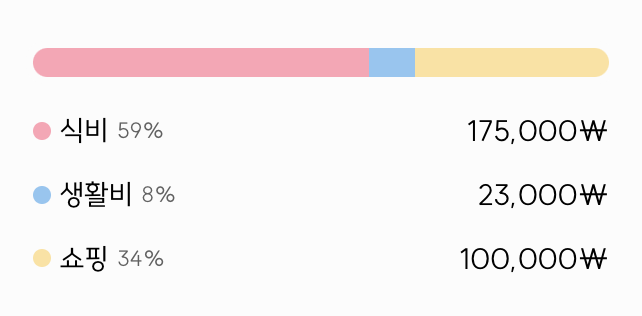

### 개요

최근 사이드프로젝트에서 chart.js를 사용하면서 소비 분석을 하는 기능을 구현했다. 파이차트와 함께 카테고리별 progress bar를 제공해주면 좋을꺼같다고 생각하여 css로 구현해봤다.

### 결과물

<div style="width: 60%;">
        
</div>

### code - width 구하기

전체 값에서 price를 나눠주고 100을 곱해서 반올림처리 후 string으로 반환 (% 포함 시켜서)

```tsx
const getFillWidth = (price: number) => {
  const percentage = Math.round((price / totalPrice) * 100).toString()

  return percentage + '%'
}
```

### code - css

- style은 `styled-components` 사용
- component로 만든 후 props 받아서 진행
- `ProgressContainer`
  - 기본 background 설정
  - border-radius 설정
  - 왼쪽, 오른쪽 부분에 상하로 radius가 들어가야된다. <br>
    → 하위 컴포넌트가 div라 `:first-child`, `:last-child` 사용
- `FillProgress`
  - 바로 위에서 말한 하위 div
  - `width`, `bgColor`를 props로 받아 받은 width 만큼 영역을 잡아준다.

```tsx
const ProgressContainer = styled.div`
  width: 100%;
  background-color: ${({ theme }) => theme.color.white};
  border-radius: 10px;
  height: 1rem;

  display: flex;
  padding: 4px;

  div:first-child {
    border-top-left-radius: 10px;
    border-bottom-left-radius: 10px;
  }

  div:last-child {
    border-top-right-radius: 10px;
    border-bottom-right-radius: 10px;
  }
`

const FillProgress = styled.div<{ $width: string; $bgColor: string }>`
  width: ${({ $width }) => $width};
  background-color: ${({ $bgColor }) => $bgColor};
  height: 1rem;
`
```

### code - props 넘겨주는 전체 코드

- charData - 가공된 데이터
- 왼쪽에선 파이차트도 같이 제공하기 때문에 파이차트에서 보여주는 같은 색을 사용하기 위해 `chartStyleDataset`의 `backgroundColor`로 접근
- 계산된 `width` props 전달

```tsx
<ProgressContainer>
  {chartData &&
    Object.entries(chartData).map(([key, value], idx) => {
      const width = getFillWidth(value)

      return (
        <FillProgress
          $width={width}
          $bgColor={chartStyleDataset.backgroundColor[idx]}
          key={key}
        />
      )
    })}
</ProgressContainer>
```

> 만약 progress bar안에 %값도 같이 써주고 싶다면,`FillProgress` 안에 `width`를 넣어주면 된다. <br/> 나는 결과물 사진에 보면 밑에서 %를 보여주기때문에 따로 넣지는 않았다.

이상 간단하게 css로 progress bar구현하기 끝 :3
