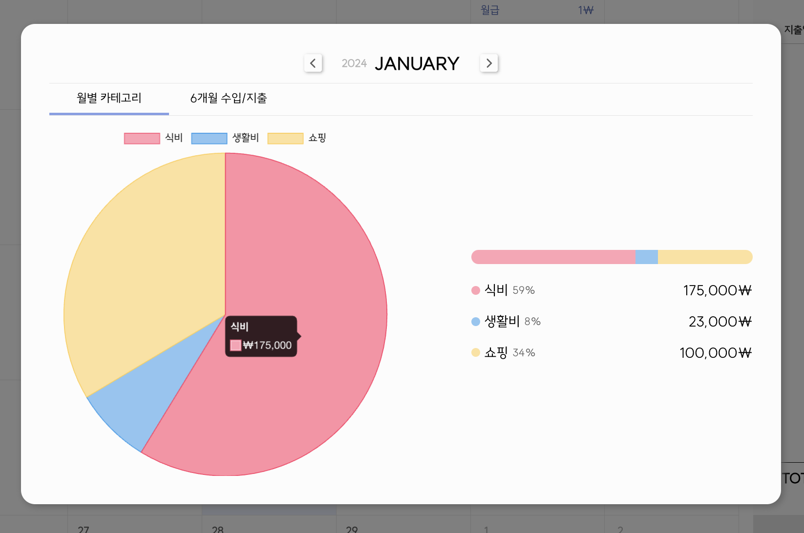

해당 글은 파이차트로 구현한 기준 글입니다.

### 설치하기

```
npm i chart.js
npm i react-chartjs-2
```

### data

- <b>기본 데이터 형태</b>

  1. `labels` : 데이터 그래프의 이름값으로 배열의 수만큼 자동으로 채워진다.
  2. `datasets`

  - label : 차트의 이름이 될것
  - backgroundColor : 차트의 색상
  - data : 배열 or 변수
  - 원하는 backgroundColor, borderColor가 있다면 정의

  ```tsx
  const data = {
      labels: ['a', 'b', 'c'],
      datasets: [
            {
                label: 'data1'
                data: ['123', '456', '789'],
                borderColor: "black",
                backgroundColor: "white",
            },
            {
                label: 'data2'
                data: ['102', '473', '379'],
                borderColor: "black",
                backgroundColor: "pink",
            }
      ],
  }
  ```

- 나같은 경우, 데이터는 API를 통해 받아오고, 달이 변경될 때마다 재세팅해줘야한다.

```tsx
const [chartData, setChartData] = useState<ChartData<
  'pie',
  number[],
  unknown
> | null>(null)
// useState로 data 정의 - ChartData는 chart.js에서 import

useEffect(() => {
  const categoryLabel = Object.keys(data)
  //data는 props에서 받음, data의 key만 뽑는다 -> 카테고리가 나올꺼고, 라벨이다
  if (categoryLabel.length != 0) {
    const dataSet = Object.values(data) //value 값 추출

    setChartData({
      ...chartData,
      labels: categoryLabel,
      datasets: [{ ...chartStyleDataset, data: dataSet }],
    })
  } else {
    setChartData(null)
  }
}, [data]) //data 변경할 때마다.
```

- `backgroundColor`, `borderColor`는 카테고리가 많다보니 따로 변수로 빼서 사용했다.

```tsx
const chartStyleDataset = {
  backgroundColor: [
    'rgba(255, 99, 132, 0.6)',
    'rgba(54, 162, 235, 0.6)',
    'rgba(255, 206, 86, 0.6)',
    'rgba(75, 192, 192, 0.6)',
    'rgba(153, 102, 255, 0.6)',
    'rgba(255, 159, 64, 0.6)',
    'rgba(92, 86, 255, 0.6)',
    'rgba(75, 192, 112,  0.6)',
    'rgba(237, 102, 255, 0.6)',
    'rgba(255, 64, 156,  0.6)',
  ],
  borderColor: [
    'rgba(255, 99, 132, 1)',
    'rgba(54, 162, 235, 1)',
    'rgba(255, 206, 86, 1)',
    'rgba(75, 192, 192, 1)',
    'rgba(153, 102, 255, 1)',
    'rgba(255, 159, 64, 1)',
    'rgba(92, 86, 255, 1)',
    'rgba(75, 192, 112, 1)',
    'rgba(237, 102, 255, 1)',
    'rgba(255, 64, 156, 1)',
  ],
  borderWidth: 1,
}
```

### register

react-chartjs-2에서 import 한 차트와 별개로 chart.js에서 필요한 것들을 import 해온 후 register를 해야 차트를 렌더링 할 수 있다.

```tsx
import { ArcElement, Chart, ChartData, Legend, Tooltip } from 'chart.js'

Chart.register(ArcElement, Tooltip, Legend)
```

### options

```tsx
const options = {
  responsive: true, //반응형, 부모요소의 크기에 맞춰 차트 비율이 조절
  animation: false as const, //animation은 주지 않았다. 달이 변경될 때마다 애니메이션이 되니 정신이 없어서
  plugins: {
    legend: {
      display: true,
      position: 'top' as const, //범례의 위치 top
      labels: {
        // labels 에 대한 스타일링
        color: '#030303', //글씨 컬러 부여
      },
    },
    tooltip: {
      callbacks: {
        label: context => {
          //마우스 hover시 툴팁에 나오는 글씨
          return `₩${context.formattedValue}`
        },
      },
    },
  },
}
```

### 컴포넌트

```tsx
import { Pie } from 'react-chartjs-2'
```

```tsx
<Pie data={chartData} options={options} />
```

### 결과물

오른쪽 progress bar 궁금하신 분은 <u>[css-progressbar구현](https://wjdgml3092.github.io/TIL/CSSProgrssbar/#code---width-%EA%B5%AC%ED%95%98%EA%B8%B0)</u> 참고하시기 바랍니다.

<div style="width: 100%;">
        
</div>

→ [다른차트가 궁금하면](https://react-chartjs-2.js.org/examples/)
