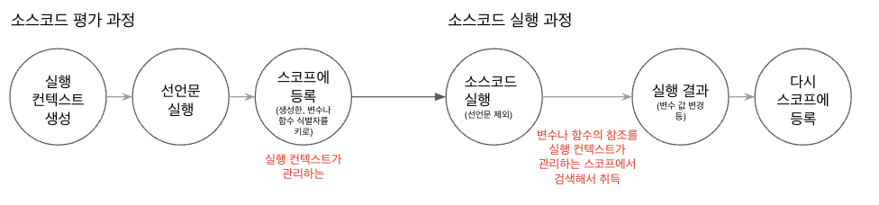
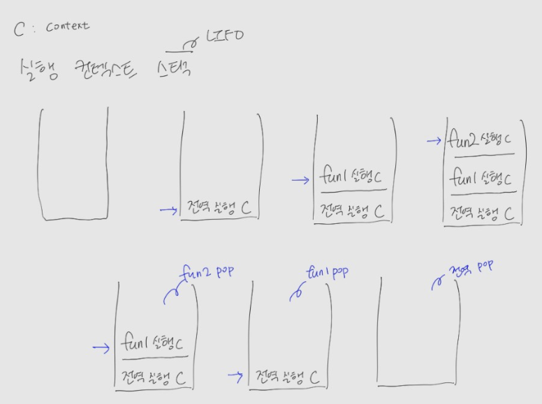

중요한 부분이라 두 부분으로 나눠서 포스팅하고자 한다. <br/>
해당 글에서는 간단한 실행 컨텍스트 개념과 역할, 실행 컨텍스트 스택, 렉시컬 환경에 대한 것을 작성하고 다음 글에서 실행 컨텍스트의 생성과 식별자 검색 과정 순서를 작성하겠다.

### 소스코드의 타입

- 자바사크립트 실행 컨텍스트 개념을 잘 이해하기 위해 소스코드의 개념부터 이해해야한다.
- ECMAScript 사양은 소스코드를 4가지 타입으로 구분한다.
  - 4가지 타입의 소스코드는 실행 컨텍스트를 생성한다.
  - 4가지 타입으로 구분하는 이유?
    - <span class='highlight'>소스코드의 타입에 따라 실행 컨텍스트를 생성하는 과정과 관리 내용이 다르기 때문이다. <span>
- **전역 코드**
  - 전역에 정의된 함수, 클래스 등의 내부 코드는 포함되지 않는다.
  - 전역 변수를 관리하기 위해 최상위 스코프인 전역 스코프를 생성해야 한다.
  - <span class='highlight'>var키워드로 선언된 전역 변수와 함수 선언문으로 정의된 전역 함수를 전역 객체의 프로퍼티와 메서드로 바인딩하고 참조하기 위해 전역 객체와 연결되어야 한다. </span>
  - 이를 위해 **전역 코드가 평가되면 전역 실행 컨텍스트**가 생성된다.
- **함수 코드**
  - 함수 내부에 중첩된 함수, 클래스 등의 내부 코드는 포함되지 않는다.
  - 함수 내부에 존재하는 코드를 말한다.
  - <span class='highlight'>지역 스코프를 생성하고 지역 변수, 매개변수, arguments 객체를 관리해야한다. </span>
  - <span class='highlight'>생성한 지역 스코프를 전역 스코프에서 시작하는 스코프 체인의 일원으로 연결해야 한다. </span>
  - 이를 위해 **함수 코드가 평가되면 함수 실행 컨텍스트**가 생성된다.
- **eval 코드**
  - 빌트인 전역 함수인 eval 함수에 인수로 전달되어 실행되는 소스코드를 말한다.
  - strict mode에서 자신만의 독자적인 스코프를 생성한다.
  - 이를 위해 **eval 코드가 평가되면 eval 실행 컨텍스트**가 생성된다.
- **모듈 코드**
  - 모듈 내부의 함수, 클래스 등의 내부 코드는 포함되지 않는다.
  - 모듈별로 독립적인 모듈 스코프를 생성한다.
  - 이를 위해 **모듈 코드가 평가되면 모듈 실행 컨텍스트**가 생성된다.

### 소스코드를 처리하는 과정

- 자바스크립트 엔진은 소스코드를 2개의 과정으로 나누어 처리한다.

  - <span class='highlight'><b>소스코드의 평가</b><span>

    - 실행 컨텍스트를 생성
    - 변수, 함수 등의 선언문만 먼저 실행
    - 생성된 변수나 함수 식별자를 키로 실행 컨텍스트가 관리하는 스코프(렉시컬 환경의 환경 레코드)에 등록한다

  - <span class='highlight'><b>소스코드의 실행</b></span>

    - 소스코드 평가 과정이 끝나면 선언문 제외하고 순차적으로 소스코드가 실행 ⇒ 즉, 런타임이 시작
    - 소스코드의 실행에 필요한 변수나 함수의 참조를 실행 컨텍스트가 관리하는 스코프에서 검색해서 취득
    - 변수 값의 변경 등 소스코드의 실행결과는 다시 실행 컨텍스트가 관리하는 스코프 등록한다.

<div style="margin: 10px 0px 0px">
   
</div>

### 실행 컨텍스트의 역할

- 아래와 같이 코드가 실행되려면 **관리가 필요**하다.
  - 선언에 의해 생성된 모든 식별자(변수, 함수, 클래스 등)를 스코프를 구분하여 등록하고 상태 변화(식별자에 바인딩된 값의 변화)를 **지속적으로 관리**할 수 있어야 한다.
  - **스코프는 중첩 관계에 위해 스코프 체인을 형성**해야 한다.
    - 스코프 체인을 통해 상위 스코프로 이동하며 식별자를 검색할 수 있어야 한다.
  - **현재 실행 중인 코드의 실행 순서**를 변경(예를 들어, 함수 호출에 의한 실행 순서 변경)할 수 있어야 하며, 다시 되돌아갈 수도 있어야 한다.

> <span class='highlight'>실행 컨텍스트는 소스코드를 실행하는 데 필요한 환경을 제공하고 코드의 실행 결과를 실제로 관리하는 영역</span>이다. <br/>
> 실행 컨텍스트는 식별자(변수, 함수, 클래스 등의 이름)를 등록하고 관리하는 스코프와 코드 실행 순서 관리를 구현한 내부 메커니즘으로, 모든 코드는 실행 컨텍스트를 통해 실행되고 관리된다.

### 실행 컨텍스트 스택

Example

```jsx
const x = 1

function fun1() {
  const y = 3

  function fun2() {
    const z = 1
    console.log(x + y - z)
  }

  fun2()
}

fun1()
```

- 전역 코드를 평가하여 전역 실행 컨텍스트를 생성해서 실행 컨텍스트 스택에 `push`한다.
  - x, fun1이 전역 실행 컨텍스트에 등록
  - 코드 실행 시작 → x에 값이 할당되고, fun1 호출
- fun1이 호출되면 전역 코드의 실행은 중단되면서, 코드의 제어권이 fun1 함수 내부로 이동한다.
  - fun1 실행 컨텍스트를 생성하고, 실행 컨텍스트 스택에 `push`한다.
  - y, fun2가 fun1 실행 컨텍스트에 등록
  - 코드 실행 시작 → y에 값 할당, fun2 호출
- fun2가 호출되면 fun1 함수 코드의 실행은 중단되면서, 코드의 제어권이 fun2 함수 내부로 이동한다.
  - fun2 실행 컨텍스트를 생성하고, 실행 컨텍스트 스택에 `push`한다.
  - z가 fun2 실행 컨텍스트에 등록
  - 코드 실행 시작 → z에 값 할당, console.log 호출 후(콘솔도 함수이므로 실행 컨텍스트 생성하고 스택에 푸시된다!) fun2는 종료된다.
- fun2는 실행이 종료되면서 fun1로 이동 → fun2 실행 컨텍스트를 실행 컨텍스트 스택에서 `pop`하여 제거한다.
- fun1이 종료되어 전역 코드로 이동한다. → fun1 실행 컨텍스트를실행 컨텍스트 스택에서 `pop`하여 제거한다.
- 전역 코드 또한 남아있는 코드가 없으므로 스택에서 `pop`되어 스택에는 아무것도 남아있지 않게된다.

<div style="width: 70%; margin: 10px auto; ">
   
</div>

> 정리하자면, <br/> <span class='highlight'><b>실행 컨텍스트 스택은 코드의 실행 순서를 관리</b></span>한다. <br/>
> 소스코드가 평가되면서 그에 맞는 실행 컨텍스트가 생성되고 스택에 쌓인다. 실행 컨텍스트의 최상위에 존재하는 실행 컨텍스트는 언제나 현재 실행 중인 코드의 실행 컨텍스트다. <br/>
> 코드가 실행되는 시간의 흐름에 따라 실행 컨텍스트 스택에 push/pop 된다.
> <br/>
> 스택은 LIFO다! <br/> <span class='highlight'>실행 컨텍스트 스택 === call stack 이라고 부르기도 한다.</span>

### 렉시컬 환경

- 스코프를 구분하여 식별자를 관리하는 저장소 역할을 한다.
- 실행 컨텍스트 구성
  - `LexicalEnvironment` / `VariableEnvironment` 2개의 컴포넌트로 구성되어있다.
- LexicalEnvironment 구성
  - `Environment Record(환경 레코드)` : 스코프에 포함된 식별자를 등록하고 등록된 식별자에 바인딩된 값을 관리하는 저장소
  - `Outer Lexical Enviromnment Reference(외부 렉시컬 환경에 대한 참조)` : 해당 실행 컨텍스트를 생성한 소스코드를 포함하는 상위 코드의 렉시컬 환경(상위 스코프)을 가리킨다. - 외부 렉시컬 환경에 대한 참조를 통해 단방향 링크드 리스트인 스코프 체인을 구현한다.

<br/>

다음글 : [실행 컨텍스트 생성과 식별자 검색 과정](<https://wjdgml3092.github.io/TIL/ExecutionContext(2)>)
