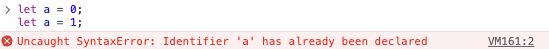

### 1. var 키워드

- <span class='highlight'>**중복 선언 가능.**</span>
- **초기화문 유무**에 따라 중복 선언은 다르게 동작한다.

  ```javaScript
  var x = 1
  var y = 1

  var x = 100
  //var 키워드로 선언된 변수는 같은 스코프 내에서 중복 선언이 가능.
  //초기화문이 있는 변수 선언은 자바스크립트 엔진에 의해 var 키워드가 없는 것처럼 동작!
  var y
  //초기화문이 없는 변수 선언은 무시

  console.log(x) //100
  console.log(y) //1
  ```

- 함수 레벨 스코프

  - var 키워드로 선언한 변수는 <span class='highlight'>**함수의 코드 블록만**을 지역 스코프로 인정한다.</span>
  - 함수 외부에서 선언한 var 키워드 변수는 코드 블록 내에서 선언해도 모두 전연 변수가 된다.

  ```javaScript
  var i = 10

  //for문에서 선언한 i는 전역 변수로, 이미 선언된 전역 변수 i가 있으므로 중복 선언된다.
  for (var i = 0; i < 5; i++) {
    console.log(i) //0 1 2 3 4
  }

  console.log(i) //5 -> 의도치않게 변경됨
  ```

  - 함수 레벨 스코프는 전역 변수를 남발할 가능성을 높이고, 의도치 않게 전역 변수가 중복 선언되는 경우가 발생한다.

- **변수 호이스팅.**
  - var 키워드로 변수를 선언하면 변수 호이스팅에 의해 런타임 이전에 undefined로 만들어진다.
  - 변수 선언문 이전에 참조할 수 있으나, 언제나 undefined를 반환한다.
    - <span class='highlight'>암묵적으로 자바스크립트 엔진이 선언단계, 초기화 단계가 한번에 진행한다.</span>

### 2. let 키워드

- **ES6**에서 등장.
- **중복 선언 불가능.**
  - 에러 발생.
  <div style="width: 80%;"></div>
- **블록 레벨 스코프.**

  - <span class='highlight'>모든 코드 블록(함수, if, for, while 등)을 지역 스코프로 인정한다.</span>

  ```javaScript
  let foo = 1 //전역 변수

  {
    let foo = 2 //지역 변수
    let bar = 1 //지역 변수
  }

  console.log(foo) //1
  console.log(bar) //Uncaught ReferenceError: bar is not defined
  ```

- **변수 호이스팅.**
  - var 키워드와 달리 변수 호이스팅이 발생하지 않는 것처럼 동작한다.
  - let 키워드로 선언한 변수는 `선언 단계` 와 `초기화 단계`가 분리되어 진행된다.
  - <span class='highlight' style='font-weight: 700'>런타임 이전에 자바스크립트 엔진에 의해 암묵적으로 선언단계는 진행되지만, 초기화 단계는 변수 선언문에 도달했을 때 실행된다.</span>
    - 초기화 단계 전에 변수 접근 시 참조 에러(ReferenceError)가 발생한다.
  - 스코프의 시작 지점부터 초기화 시작 지점까지 변수를 참조할 수 없는 구간을 `일시적 사각지대`(TDZ: Temporal Dead Zone)이라고 한다.

### 3. const 키워드

- **ES6**에서 등장.
- **let 키워드와 거의 동일**하게 블록 레벨 스코프를 가지며, 변수 호이스팅이 발생하지 않는 것처럼 동작한다.
- const 키워드로 선언한 변수는 <span class='highlight'>**반드시 선언과 동시에 초기화**</span>해야 한다.
- **재할당 금지.**
- 재할당 금지의 특징을 이용해서 const 키워드는 **상수를 표현**하는데 사용하기도 한다.
  - 상수의 이름은 **대문자**로 선언한다.
  - 여러 단어로 이뤄진 경우, **스네이크 케이스**로 표현하는 것이 일반적이다.
- 객체

  - const 키워드로 선언된 변수는 재할당이 불가하지만,<span class='highlight'> **객체를 할당한 경우 값을 변경할 수 있다.** </span> <br/> &rarr; 원시값(변경 불가능한 값)은 재할당 없이 변경할 수 있는 방법이 없지만, 변경 가능한 객체는 재할당 없이도 직접 변경이 가능하기 때문이다.

    ```javaScript
    const persone = {
      name: 'Jung',
    }

    //객체는 변경 가능할 값이다. 재할당 없이 변경이 가능하다!
    person.name = 'Kim'

    console.log(persone) // {name: 'Kim'}
    ```

      <aside>
      💡 const 키워드는 재할당을 금지할 뿐 “불변”을 의미하지는 않는다.
      </aside>

### 정리

- 변수 선언 시 기본적으로 const를 사용하고, 재할딩이 필요한 경우 let을 사용하는 것이 좋다.
- ES6를 사용한다면 var 키워드는 사용하지 않는다.
- 재할당이 필요한 경우 한정해 let 키워드를 사용한다.
- 변경이 발생하지 않고 읽기 전용으로 사용하는 원시 값과 객체에는 const 키워드를사용한다. <br/> ↳ const는 재할당을 금지하므로 var, let 키워드보다 안전하다.

<br/>
