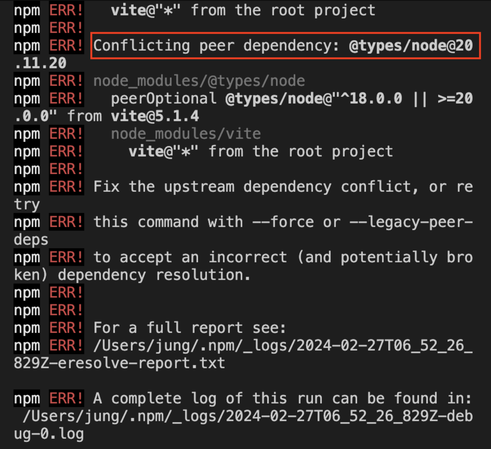
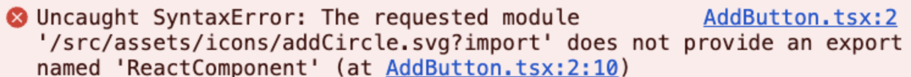
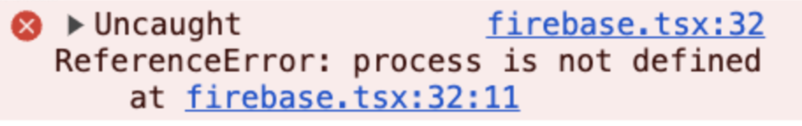

### CRA와 Vite

<span class='highlight'><b>CRA(create react app)</b>은 리액트 프로젝트를 시작할 때 필요한 개발 환경을 세팅해주는 도구다.</span> CRA의 장점을 쉽다. 명령어 하나로 모든 설치가 완료된다. 모듈 번들러로 Webpack을 사용하고, Webpack은 자바스크립트 코드로 구성된 툴이다. 자바스크립트는 interpreted 언어라 느리다. <br/>그래서 이 단점을 보완해서 나온게 Esbuild인데, Esbuild 기반으로 만들어진 프론트엔드 빌드툴이 바로 <b>Vite</b>다. <span class='highlight'> Vite의 핵심은 ES 모듈을 사용하여 브라우저가 필요로 하는 어플리케이션 코드의 일부분만 변환하고 제공하는 것이다.</span>

> Vite는 번들링을 생략하여 개발 서버를 빠르게 구동시킨다. (이건 작동시키면 조금이라도 느껴진다. 바로 실행되는 것이.)

### 1. vite 설치

```shell
npm install -D vite @vitejs/plugin-react vite-plugin-svgr
```

- svg를 사용하고 있는 프로젝트라면, `vite-plugin-svgr` 설치 필요 <br/>
  - <span class='highlight'>svgr이란 svg를 리액트의 컴포넌트로 변환시켜주는 라이브러리</span>
  - CRA로 리액트 앱을 초기화 하면 자동으로 설정이 되어있지만, vite로 리액트 앱 초기화시 직접 설정해줘야 한다. <br/>
    (svg가 잘 import가 안된다면 → [트러블 슈팅 2번](https://wjdgml3092.github.io/TIL/ViteMigration/#%ED%8A%B8%EB%9F%AC%EB%B8%94-%EC%8A%88%ED%8C%85-2---svg-import-error))

<의존성 에러가 난다면 → [트러블 슈팅 1번](https://wjdgml3092.github.io/TIL/ViteMigration/#%ED%8A%B8%EB%9F%AC%EB%B8%94-%EC%8A%88%ED%8C%85-1---%EB%9D%BC%EC%9D%B4%EB%B8%8C%EB%9F%AC%EB%A6%AC-dependency-%EC%B6%A9%EB%8F%8C)>

### 2. vite.config.ts 파일 작성

```tsx
import { defineConfig } from 'vite'
import react from '@vitejs/plugin-react'
import svgrPlugin from 'vite-plugin-svgr'

export default defineConfig({
  plugins: [react(), svgrPlugin()],
})
```

### 3. index.html 파일 위치 변경 및 수정

- index.html 파일 위치 변경
  - `/public` 경로에 있는 index.html 파일을 프로젝트 루트 경로로 옮긴다.<br/>
    이유는 [여기서](https://vitejs.dev/guide/#index-html-and-project-root) 확인하기
- index.html 수정

  - URL은 Vite에서 약간 다르게 취급되므로 `%PUBLIC_URL%`의 모든 참조를 제거해야 한다.

    ```tsx
    //example
    //before
    <link rel="icon" href="%PUBLIC_URL%/favicon.ico" />

    //after
    <link rel="icon" href="/favicon.ico" />
    ```

  - body 요소 진입점 추가

    ```tsx
    <noscript>You need to enable JavaScript to run this app.</noscript>

    <div id="root"></div>
    <!-- 아래 스크립트 태그 추가 -->
    <script type="module" src="/src/index.tsx"></script>
    ```

### 4. tsconfing.json 수정

- target, lib, types 수정해줬다.

```JSON
"target": "ESNext",
"lib": ["DOM", "DOM.Iterable", "esnext"],
"types": ["vite/client", "vite-plugin-svgr/client"],
```

### 5. env파일이 정의되어있다면,

파이어베이스 관련 값들을 env로 관리했다. <br/>CRA였다면, 다들 `REACT_`로 시작했을 것이다.
Vite로 갈아타니깐 `VITE_`로 변경해준다.
<br/>
<b>만약 배포서버에서 env를 관리하고 있다면 같이 변경해주기!</b><br/>(나는 vercel로 배포해서 vercel에서 변경해줬다.)

### 6. CRA 제거 및 pacakage.json 수정

- CRA 제거 <br/>
  `npm uninstall react-scripts`
- package.json 수정

  ```JSON
  "scripts": {
      "dev": "vite",
      "build": "tsc && vite build",
      "serve": "vite preview"
  },
  ```

### 7. 실행

`npm run dev`로 잘되는지 확인했다.

### 트러블 슈팅 (1) - 라이브러리 dependency 충돌

vite 설치 시작부터 dependency 에러 발견.

<div style="width: 50%;">
        
</div>

`npm install —save-dev @types/node@latest`
→ 최신버전 설치 먼저 진행 <br/>
`npm i vite @vitejs/plugin-react vite-plugin-svgr`
→ 다시 설치해보니 됐다.

### 트러블 슈팅 (2) - svg import error

세팅 완료 후 실행을 해보니, 흰화면에 아래 에러를 만났다.

<div style="width: 100%;">
    
</div>

<br/>

- import 변경

```tsx
//before
import { ReactComponent as Minus } from '../../assets/icons/minusCircle.svg'

//after
import Minus from '../../assets/icons/minusCircle.svg?react'
```

[참고링크](https://github.com/pd4d10/vite-plugin-svgr)

### 트러블 슈팅 (3) - env 접근

<div style="width: 80%;">
    
</div>

Vite는 `import.meta.env.VITE_` 형태로 호출할 수 있다.

```tsx
//before
apiKey: process.env.REACT_APP_FIREBASE_API_KEY,

//after
apiKey: import.meta.env.VITE_FIREBASE_API_KEY,
```

[참고링크](https://ko.vitejs.dev/guide/env-and-mode.html)

### 마이그레이션 완료 :)

마이그레이션 후, 슬쩍 전에 만든 사이드프로젝트 배포 주소 올리기 🫡
[하루모아](https://harumoa.vercel.app)
